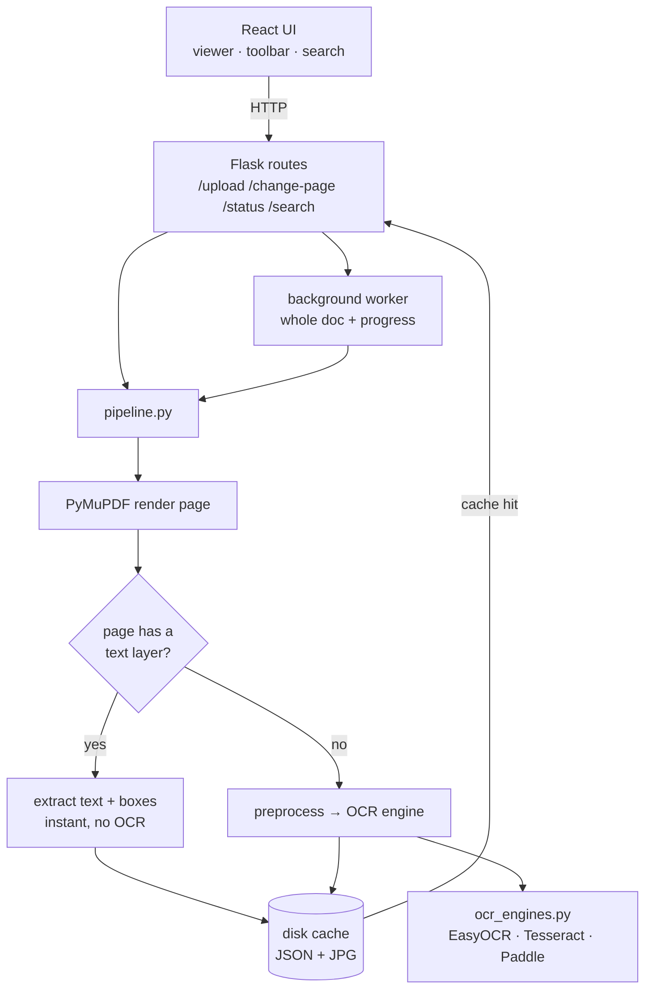

<div align="center">

# 📄 DocuLens

**Turn any PDF — even a scanned image — into a searchable, selectable, annotatable document.**


_[Live Demo](#) · [How it works](#-how-it-works) · [Quick start](#-quick-start)_

</div>

> **Replace the links above** with your Hugging Face Space URL once deployed (see [DEPLOY.md](DEPLOY.md)).

<!-- Add a screen recording here — this is the single most important thing an interviewer sees. -->
<p align="center">
  
</p>

---

## The problem

A huge share of the world's documents — textbooks, contracts, archives, receipts —
exist only as **scanned images inside PDFs**. To a computer they're just pictures:

- ❌ Text can't be selected, searched, or copied
- ❌ You can't highlight or annotate meaningfully
- ❌ They behave like flat images, not documents

**DocuLens** makes them behave like real documents — in the browser.

---

## ✨ Features

| | |
|---|---|
| 🧠 **Right tool per page** | Detects whether a page already has a real text layer and reads it directly (instant, perfect). Only *actual scans* are sent to OCR. |
| ⚡ **Digital-text fast path** | Non-scanned PDFs skip OCR entirely — sub-second, 100% accurate. Shown live via a `⚡ Digital text / 🔍 OCR` badge. |
| 🔍 **Cross-page search** | Search the recognized text across every processed page and jump straight to a hit, highlighted on the page. |
| 🖊️ **Annotate** | Pen, highlighter, and eraser on a canvas layer. Annotations **persist across page changes and zoom** (stored in zoom-independent coordinates). |
| 🚀 **Background OCR + progress** | Page 1 loads immediately; the rest of the document processes in a background thread with a live progress bar. |
| 💾 **Process once, ever** | Every page's text + image is cached to disk, so re-opening a page is instant even after a restart. |
| 🔌 **Pluggable OCR** | EasyOCR by default; swap to Tesseract or PaddleOCR via a single env var, behind one interface. |

---

## 🏗️ Architecture

Single-origin deploy: the React app is built to static files and served by Flask
alongside the API, so the whole thing runs as **one container**.



**The core idea** (`pipeline.py`): a page is only ever OCR'd if it truly needs it,
and only once — everything else is a cache hit or the embedded-text fast path.

---

## 🧩 How it works

A few decisions worth calling out:

- **Embedded-text detection.** `PyMuPDF` renders pages *and* exposes the embedded
  text layer. If a page has real words, we use them directly (with exact word
  boxes) — no OCR, no error, instant. Only image-only scans hit the OCR engine.
  This makes the app faster **and** more accurate on the common case.

- **Zoom-independent annotations.** Strokes are stored per page in the page's
  *natural* pixel space and re-rendered at the current zoom, so drawings survive
  zooming and page navigation instead of being wiped on every redraw.

- **Cache is self-sufficient.** Each page's OCR/text, dimensions, and page count
  are cached to disk as JSON. A cached page is served **without even opening the
  source PDF**, which is what keeps navigation instant.

- **Concurrency done carefully.** The OCR model isn't thread-safe, so its calls
  are serialized behind a lock — while rendering, caching, and cache hits stay
  concurrent, and a background thread processes the rest of the document.

- **Pluggable engines.** Every OCR backend implements one `readtext(image)`
  method returning normalized boxes, selected by the `OCR_ENGINE` env var.

---

## 🛠️ Tech stack

**Backend** — Python · Flask · PyMuPDF (render + text) · OpenCV · EasyOCR (PyTorch) · Gunicorn
**Frontend** — React 19 · Vite · HTML5 Canvas · lucide-react
**Ops** — Docker (multi-stage) · Hugging Face Spaces

---

## 🚀 Quick start

### Option A — Docker (one command)

```bash
docker compose up --build
# open http://localhost:7860
```

### Option B — Local dev

```bash
# Backend
python -m venv .venv && source .venv/bin/activate
pip install -r requirements.txt
python server.py                 # API on :5002

# Frontend (second terminal)
cd frontend && npm install
npm run dev                      # UI on :5173 (proxies the API)
```

> No system dependencies needed — PyMuPDF renders PDFs without Poppler.
> EasyOCR downloads its models on first use (CPU works; a CUDA GPU is used
> automatically if present).

---

## ⚙️ Configuration

All optional, via environment variables:

| Variable | Default | Description |
|---|---|---|
| `OCR_ENGINE` | `easyocr` | `easyocr` (printed) · `tesseract` · `paddle` · `trocr` (handwriting) |
| `RENDER_DPI` | `220` | Page render resolution (300 = sharper, slower) |
| `MIN_EMBEDDED_WORDS` | `3` | Words needed to treat a page as digital vs a scan |
| `OCR_MIN_CONF` | `0.3` | Drop OCR results below this confidence |
| `EASYOCR_GPU` | auto | `1`/`0` to force GPU/CPU |
| `MAX_PAGES` / `MAX_UPLOAD_MB` | `300` / `50` | Upload guardrails |

---

## 🧪 Tests & benchmark

```bash
pytest -q                        # fast — digital-PDF tests skip the OCR model
python benchmark.py some.pdf     # per-page timing + embedded/ocr breakdown
```

---

## 🗺️ Roadmap

- Persist annotations to disk / export an annotated PDF
- Real thumbnail previews in the sidebar
- Multi-language OCR toggle
- Optional deskew for low-quality scans

---

## 📄 License

[MIT](LICENSE) © Saachi
